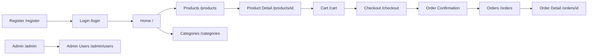

# CoreKit ECommerce — Wireframes (Text-Based)

| Field            | Value                     |
| ---------------- | ------------------------- |
| **Project**      | CoreKit ECommerce         |
| **Version**      | 1.0.0                    |
| **Date**         | 2026-04-14                |

> These are low-fidelity, text-based wireframes describing the layout and key elements of each page in the CoreKit storefront and admin panel.

---

## 1. Global Layout

```
┌─────────────────────────────────────────────────────────┐
│  🛒 CoreKit Logo     [Categories ▼]  🔍 Search          │
│                      Home | Products | Cart | Account   │
├─────────────────────────────────────────────────────────┤
│                                                         │
│                    [ PAGE CONTENT ]                      │
│                                                         │
├─────────────────────────────────────────────────────────┤
│  Footer: About · Privacy · Terms · Contact   © CoreKit  │
└─────────────────────────────────────────────────────────┘
```

**Navbar Elements:**
- Logo (links to `/`)
- Category dropdown
- Search bar
- Navigation: Home, Products, Cart (with badge), Account/Login
- Responsive: hamburger menu on mobile

---

## 2. Home Page (`/`)

```
┌─────────────────────────────────────────────────────────┐
│                     NAVBAR                               │
├─────────────────────────────────────────────────────────┤
│  ┌─────────────────────────────────────────────────┐    │
│  │             HERO BANNER / CAROUSEL               │    │
│  │    "Discover Premium Products"                    │    │
│  │            [ Shop Now → ]                         │    │
│  └─────────────────────────────────────────────────┘    │
│                                                         │
│  ── Featured Categories ──────────────────────────────  │
│  ┌──────┐  ┌──────┐  ┌──────┐  ┌──────┐              │
│  │ Cat1 │  │ Cat2 │  │ Cat3 │  │ Cat4 │              │
│  │ img  │  │ img  │  │ img  │  │ img  │              │
│  └──────┘  └──────┘  └──────┘  └──────┘              │
│                                                         │
│  ── New Arrivals ─────────────────────────────────────  │
│  ┌───────┐ ┌───────┐ ┌───────┐ ┌───────┐             │
│  │ Image │ │ Image │ │ Image │ │ Image │             │
│  │ Name  │ │ Name  │ │ Name  │ │ Name  │             │
│  │ ₹Price│ │ ₹Price│ │ ₹Price│ │ ₹Price│             │
│  │ [Add] │ │ [Add] │ │ [Add] │ │ [Add] │             │
│  └───────┘ └───────┘ └───────┘ └───────┘             │
│                                                         │
├─────────────────────────────────────────────────────────┤
│                     FOOTER                               │
└─────────────────────────────────────────────────────────┘
```

---

## 3. Products Listing Page (`/products`)

```
┌─────────────────────────────────────────────────────────┐
│                     NAVBAR                               │
├───────────┬─────────────────────────────────────────────┤
│ FILTERS   │  Sort by: [Newest ▼]     Showing 24 results │
│           │                                             │
│ Category  │  ┌───────┐ ┌───────┐ ┌───────┐             │
│ ☐ Cat 1   │  │ Img   │ │ Img   │ │ Img   │             │
│ ☐ Cat 2   │  │ Title │ │ Title │ │ Title │             │
│ ☐ Cat 3   │  │ ₹999  │ │ ₹1499 │ │ ₹599  │             │
│           │  │ ★★★★☆ │ │ ★★★☆☆ │ │ ★★★★★ │             │
│ Price     │  └───────┘ └───────┘ └───────┘             │
│ ₹[__]-[__]│                                             │
│           │  ┌───────┐ ┌───────┐ ┌───────┐             │
│ Status    │  │ Img   │ │ Img   │ │ Img   │             │
│ ● Active  │  │ Title │ │ Title │ │ Title │             │
│           │  │ ₹749  │ │ ₹2199 │ │ ₹399  │             │
│           │  │ ★★★☆☆ │ │ ★★★★☆ │ │ ★★★★☆ │             │
│           │  └───────┘ └───────┘ └───────┘             │
│           │                                             │
│           │  [ ← Prev ]  1  2  3  [ Next → ]           │
└───────────┴─────────────────────────────────────────────┘
```

---

## 4. Product Detail Page (`/products/[id]`)

```
┌─────────────────────────────────────────────────────────┐
│                     NAVBAR                               │
├─────────────────────────────────────────────────────────┤
│  Breadcrumb: Home > Category > Product Name             │
│                                                         │
│  ┌────────────────┐  Product Name                       │
│  │                │  Brand: BrandName                    │
│  │   MAIN IMAGE   │  ★★★★☆ (24 reviews)                 │
│  │                │                                     │
│  │                │  ₹1,299  ₹̶1̶,̶9̶9̶9̶  (35% off)         │
│  └────────────────┘                                     │
│  [thumb1][thumb2]     Variant: [Size ▼] [Color ▼]       │
│  [thumb3][thumb4]     Stock: In Stock (12 left)         │
│                                                         │
│                       Qty: [- 1 +]                      │
│                       [ 🛒 Add to Cart ]                 │
│                                                         │
│  ── Description ──────────────────────────────────────  │
│  Lorem ipsum dolor sit amet, consectetur adipiscing     │
│  elit. Sed do eiusmod tempor incididunt...              │
│                                                         │
│  ── Customer Reviews ─────────────────────────────────  │
│  ┌─────────────────────────────────────────────────┐   │
│  │ ★★★★★  "Great quality!"  — John D.  ✓ Verified  │   │
│  │ Really happy with this purchase...               │   │
│  └─────────────────────────────────────────────────┘   │
│  ┌─────────────────────────────────────────────────┐   │
│  │ ★★★☆☆  "Decent"  — Jane S.                      │   │
│  │ Could be better packaging...                     │   │
│  └─────────────────────────────────────────────────┘   │
├─────────────────────────────────────────────────────────┤
│                     FOOTER                               │
└─────────────────────────────────────────────────────────┘
```

---

## 5. Categories Page (`/categories`)

```
┌─────────────────────────────────────────────────────────┐
│                     NAVBAR                               │
├─────────────────────────────────────────────────────────┤
│  All Categories                                         │
│                                                         │
│  ┌──────────┐  ┌──────────┐  ┌──────────┐              │
│  │  Image   │  │  Image   │  │  Image   │              │
│  │ Cat Name │  │ Cat Name │  │ Cat Name │              │
│  │ 12 items │  │ 8 items  │  │ 25 items │              │
│  └──────────┘  └──────────┘  └──────────┘              │
│                                                         │
│    └── Sub-categories shown as nested cards/chips       │
│                                                         │
├─────────────────────────────────────────────────────────┤
│                     FOOTER                               │
└─────────────────────────────────────────────────────────┘
```

---

## 6. Cart Page (`/cart`)

```
┌─────────────────────────────────────────────────────────┐
│                     NAVBAR                               │
├─────────────────────────────────────────────────────────┤
│  Shopping Cart (3 items)                                │
│                                                         │
│  ┌─────────────────────────────────────────────────┐   │
│  │ [Img] Product Name          Qty:[- 2 +]  ₹2,598│   │
│  │       Variant: Blue / L     Unit: ₹1,299   [🗑]│   │
│  ├─────────────────────────────────────────────────┤   │
│  │ [Img] Product Name 2        Qty:[- 1 +]  ₹  599│   │
│  │       Variant: Default      Unit: ₹599     [🗑]│   │
│  ├─────────────────────────────────────────────────┤   │
│  │ [Img] Product Name 3        Qty:[- 1 +]  ₹  749│   │
│  │       Variant: Red / M      Unit: ₹749     [🗑]│   │
│  └─────────────────────────────────────────────────┘   │
│                                                         │
│  Coupon: [____________] [Apply]                         │
│  ✅ Coupon SAVE10 applied! (-₹394.60)                   │
│                                                         │
│  ┌──────────────────────────┐                           │
│  │ Subtotal:       ₹3,946  │                           │
│  │ Discount:       -₹394   │                           │
│  │ Tax:            +₹320   │                           │
│  │ Shipping:       +₹49    │                           │
│  │ ─────────────────────── │                           │
│  │ Grand Total:    ₹3,921  │                           │
│  │                          │                           │
│  │ [ Proceed to Checkout → ]│                           │
│  └──────────────────────────┘                           │
│                                                         │
│  [Clear Cart]                                           │
├─────────────────────────────────────────────────────────┤
│                     FOOTER                               │
└─────────────────────────────────────────────────────────┘
```

---

## 7. Checkout Page (`/checkout`)

```
┌─────────────────────────────────────────────────────────┐
│                     NAVBAR                               │
├─────────────────────────────────────────────────────────┤
│  Checkout                                               │
│                                                         │
│  ── Step 1: Shipping Address ─────────────────────────  │
│  ┌──────────────────────┐  ┌──────────────────────┐    │
│  │ ● Home Address       │  │ ○ Office Address     │    │
│  │   John Doe           │  │   John Doe           │    │
│  │   123 Main St, Apt 4 │  │   456 Work Ave       │    │
│  │   Mumbai, MH 400001  │  │   Pune, MH 411001    │    │
│  │   📞 +91-9876543210  │  │   📞 +91-9876543210  │    │
│  └──────────────────────┘  └──────────────────────┘    │
│  [ + Add New Address ]                                  │
│                                                         │
│  ── Step 2: Billing Address ──────────────────────────  │
│  ☑ Same as shipping address                             │
│                                                         │
│  ── Step 3: Payment Method ───────────────────────────  │
│  ○ Razorpay (UPI / Card / Netbanking / Wallet)          │
│  ○ Cash on Delivery (COD)                               │
│                                                         │
│  ── Order Summary ────────────────────────────────────  │
│  │ 3 items · Subtotal: ₹3,946 · Total: ₹3,921        │
│  │ [View Items ▼]                                      │
│                                                         │
│  Customer Note: [____________________________]          │
│                                                         │
│  [ ← Back to Cart ]          [ Place Order → ]          │
├─────────────────────────────────────────────────────────┤
│                     FOOTER                               │
└─────────────────────────────────────────────────────────┘
```

---

## 8. Orders Page (`/orders`)

```
┌─────────────────────────────────────────────────────────┐
│                     NAVBAR                               │
├─────────────────────────────────────────────────────────┤
│  My Orders                                              │
│                                                         │
│  ┌─────────────────────────────────────────────────┐   │
│  │ #ORD-20260414-001    📅 14 Apr 2026              │   │
│  │ 3 items · ₹3,921                                │   │
│  │ Status: [CONFIRMED]  Payment: [CAPTURED]         │   │
│  │                              [ View Details → ]  │   │
│  ├─────────────────────────────────────────────────┤   │
│  │ #ORD-20260410-002    📅 10 Apr 2026              │   │
│  │ 1 item · ₹1,299                                 │   │
│  │ Status: [SHIPPED]    Payment: [CAPTURED]         │   │
│  │                              [ View Details → ]  │   │
│  ├─────────────────────────────────────────────────┤   │
│  │ #ORD-20260405-003    📅 05 Apr 2026              │   │
│  │ 2 items · ₹2,498                                │   │
│  │ Status: [COMPLETED]  Payment: [CAPTURED]         │   │
│  │                              [ View Details → ]  │   │
│  └─────────────────────────────────────────────────┘   │
├─────────────────────────────────────────────────────────┤
│                     FOOTER                               │
└─────────────────────────────────────────────────────────┘
```

---

## 9. Order Detail Page (`/orders/[id]`)

```
┌─────────────────────────────────────────────────────────┐
│                     NAVBAR                               │
├─────────────────────────────────────────────────────────┤
│  Order #ORD-20260414-001                                │
│  Placed on 14 Apr 2026                                  │
│                                                         │
│  Status: CONFIRMED    Payment: CAPTURED                 │
│  Fulfilment: PENDING                                    │
│                                                         │
│  ── Status Timeline ──────────────────────────────────  │
│  ● CREATED (14 Apr, 10:00 AM)                           │
│  ● CONFIRMED (14 Apr, 10:05 AM) — "Payment verified"   │
│  ○ PROCESSING                                           │
│  ○ SHIPPED                                              │
│  ○ COMPLETED                                            │
│                                                         │
│  ── Items ────────────────────────────────────────────  │
│  [Img] Product Name × 2   ₹1,299 × 2 = ₹2,598         │
│  [Img] Product Name 2 × 1 ₹599 × 1   = ₹599           │
│                                                         │
│  ── Price Breakdown ──────────────────────────────────  │
│  Subtotal:    ₹3,946                                    │
│  Discount:    -₹394                                     │
│  Tax:         +₹320                                     │
│  Shipping:    +₹49                                      │
│  Grand Total: ₹3,921                                    │
│                                                         │
│  ── Addresses ────────────────────────────────────────  │
│  Shipping: John Doe, 123 Main St, Mumbai 400001        │
│  Billing:  Same as shipping                             │
│                                                         │
│  Customer Note: "Please deliver before 5 PM"            │
├─────────────────────────────────────────────────────────┤
│                     FOOTER                               │
└─────────────────────────────────────────────────────────┘
```

---

## 10. Login Page (`/login`)

```
┌─────────────────────────────────────────────────────────┐
│                     NAVBAR                               │
├─────────────────────────────────────────────────────────┤
│                                                         │
│           ┌──────────────────────────┐                  │
│           │      Welcome Back        │                  │
│           │                          │                  │
│           │  Email:                  │                  │
│           │  [____________________]  │                  │
│           │                          │                  │
│           │  Password:               │                  │
│           │  [____________________]  │                  │
│           │                          │                  │
│           │  [      Log In      ]    │                  │
│           │                          │                  │
│           │  ─── or ───              │                  │
│           │                          │                  │
│           │  [🔵 Sign in with Google] │                  │
│           │  [ 📧 Login with OTP ]    │                  │
│           │                          │                  │
│           │  Don't have an account?  │                  │
│           │  [ Register → ]          │                  │
│           └──────────────────────────┘                  │
│                                                         │
├─────────────────────────────────────────────────────────┤
│                     FOOTER                               │
└─────────────────────────────────────────────────────────┘
```

---

## 11. Register Page (`/register`)

```
┌─────────────────────────────────────────────────────────┐
│                     NAVBAR                               │
├─────────────────────────────────────────────────────────┤
│                                                         │
│           ┌──────────────────────────┐                  │
│           │    Create an Account     │                  │
│           │                          │                  │
│           │  First Name:             │                  │
│           │  [____________________]  │                  │
│           │                          │                  │
│           │  Last Name (optional):   │                  │
│           │  [____________________]  │                  │
│           │                          │                  │
│           │  Email:                  │                  │
│           │  [____________________]  │                  │
│           │                          │                  │
│           │  Password:               │                  │
│           │  [____________________]  │                  │
│           │                          │                  │
│           │  Phone (optional):       │                  │
│           │  [____________________]  │                  │
│           │                          │                  │
│           │  [    Register     ]     │                  │
│           │                          │                  │
│           │  Already have an account?│                  │
│           │  [ Log In → ]            │                  │
│           └──────────────────────────┘                  │
│                                                         │
├─────────────────────────────────────────────────────────┤
│                     FOOTER                               │
└─────────────────────────────────────────────────────────┘
```

---

## 12. Admin Panel (`/admin`)

```
┌─────────────────────────────────────────────────────────┐
│                    ADMIN NAVBAR                          │
├───────────┬─────────────────────────────────────────────┤
│ SIDEBAR   │  Dashboard Overview                         │
│           │                                             │
│ Dashboard │  ┌──────┐ ┌──────┐ ┌──────┐ ┌──────┐      │
│ Users     │  │ 124  │ │  38  │ │ ₹2.4L│ │  12  │      │
│ Products  │  │Users │ │Orders│ │ Rev. │ │ Pend.│      │
│ Orders    │  └──────┘ └──────┘ └──────┘ └──────┘      │
│ Categories│                                             │
│ Coupons   │  ── Recent Orders ────────────────────────  │
│ Shipping  │  │ #ORD-001 │ John │ ₹3,921 │ CONFIRMED │  │
│ Settings  │  │ #ORD-002 │ Jane │ ₹1,299 │ SHIPPED   │  │
│           │  │ #ORD-003 │ Mike │ ₹2,498 │ COMPLETED │  │
│           │                                             │
│           │  ── Low Stock Alerts ─────────────────────  │
│           │  │ SKU-001 │ Widget Blue │ 2 remaining    │  │
│           │  │ SKU-015 │ Gadget Red  │ 0 remaining    │  │
└───────────┴─────────────────────────────────────────────┘
```

---

## 13. Admin — User Management (`/admin/users`)

```
┌─────────────────────────────────────────────────────────┐
│                    ADMIN NAVBAR                          │
├───────────┬─────────────────────────────────────────────┤
│ SIDEBAR   │  User Management          [+ Invite User]  │
│           │                                             │
│ ...       │  Search: [___________]  Role: [All ▼]       │
│           │                                             │
│ ► Users   │  ┌───────────────────────────────────────┐  │
│           │  │ Name    │ Email   │ Role   │ Status │  │  │
│           │  ├─────────┼─────────┼────────┼────────┤  │  │
│           │  │ John D. │ j@e.com │ ADMIN  │ ACTIVE │  │  │
│           │  │ Jane S. │ s@e.com │ CUST.  │ ACTIVE │  │  │
│           │  │ Mike V. │ m@e.com │ VENDOR │ ACTIVE │  │  │
│           │  │ Staff 1 │ t@e.com │ STAFF  │ ACTIVE │  │  │
│           │  └───────────────────────────────────────┘  │
│           │                                             │
│           │  Role Change: Select user → [Role ▼] [Save] │
└───────────┴─────────────────────────────────────────────┘
```

---

## Page Navigation Flow



---

## Appendix A — v1.1 Extended Page Map (2026-04-21)

Adds functionality beyond the original scope: account management, wishlist, password recovery, review UX, richer admin with RBAC, and creative polish (cart drawer, command palette, recently viewed, promo banner).

### Storefront pages

| Route | Purpose | Auth | States |
|-------|---------|:---:|--------|
| `/` | Home — hero, value props, featured categories, latest arrivals, recently viewed | Public | loading, error, empty |
| `/products` | Product listing + filters + sort + search (`?q=`, `?category=`) | Public | loading, error, empty |
| `/products/[id]` | Product detail — gallery, variants, stock, reviews, wishlist, breadcrumbs | Public | loading, error (404) |
| `/categories` | Browse categories grid | Public | loading, error, empty |
| `/cart` | Full cart view — qty, remove, coupon apply, totals | Required | empty, loading |
| `/checkout` | 3-step (Address → Payment → Review) with progress indicator | Required | loading, error |
| `/orders` | Customer order list with status + payment badges | Required | loading, error, empty |
| `/orders/[id]` | Order detail — 5-step timeline, items, totals, addresses, "order placed" banner (`?placed=1`) | Required | loading, error (404) |
| `/wishlist` | Saved products (localStorage) | Public | empty |
| `/account` | Profile tabs: Profile · Security (reset password) · Preferences (theme, email prefs) | Required | — |
| `/account/addresses` | Address book CRUD with default flag | Required | loading, empty, error |
| `/login` | Password + Email OTP + Google + temporary "Dev admin" button | Public | error, loading |
| `/register` | Sign-up | Public | error, loading |
| `/forgot-password` | Request reset link | Public | success state |
| `/reset-password?token=` | Set new password via link | Public | missing-token, success |
| `/not-found` | 404 page | Public | — |

### Admin pages (RBAC-gated: ADMIN / STAFF / SUPERADMIN; VENDOR sees catalog only)

| Route | Purpose | Required role |
|-------|---------|---------------|
| `/admin` | Dashboard — live revenue/orders/users/products cards, recent orders, quick actions | ADMIN · STAFF · SUPERADMIN |
| `/admin/orders` | Orders list with filters, search, pagination | ADMIN · STAFF · SUPERADMIN |
| `/admin/orders/[id]` | Order detail with status update + timeline | ADMIN · STAFF · SUPERADMIN |
| `/admin/products` | Catalog list with filters + pagination | ADMIN · STAFF · VENDOR · SUPERADMIN |
| `/admin/products/new` | Create product (draft) | ADMIN · STAFF · VENDOR · SUPERADMIN |
| `/admin/products/[id]` | Edit product, publish/unpublish, assign categories, delete (ADMIN only) | ADMIN · STAFF · VENDOR · SUPERADMIN |
| `/admin/categories` | Hierarchical tree with inline CRUD | ADMIN · STAFF · SUPERADMIN |
| `/admin/coupons` | Placeholder (pending backend `/coupons` CRUD) | ADMIN · STAFF · SUPERADMIN |
| `/admin/reviews` | Placeholder (pending backend `/reviews` moderation) | ADMIN · STAFF · SUPERADMIN |
| `/admin/shipping` | Zones + rate rules CRUD, COD toggle per rule | ADMIN · SUPERADMIN |
| `/admin/users` | User list, search, role change | ADMIN · SUPERADMIN |
| `/admin/settings` | Tenant info + local preferences (dark mode, COD toggle) | ADMIN · SUPERADMIN |

### Cross-cutting UI

| Component | Location | Notes |
|-----------|----------|-------|
| Cart drawer | Navbar cart icon | Slide-in with qty stepper + checkout CTA |
| Global toast | `ToastProvider` at app root | success/error/warning/info, auto-dismiss |
| Confirm dialog | `ConfirmDialogProvider` + `useConfirm()` | Promise-based imperative API |
| Modal | `<Modal>` primitive | Focus-trap, ESC, backdrop-click close |
| Command palette | Admin shell, ⌘K / Ctrl+K | Fuzzy search admin routes, keyboard navigation |
| Promo banner | Top of storefront shell | Dismissable via localStorage |
| Recently viewed | Home page strip | Up to 8 products tracked in localStorage |
| Wishlist heart | Product cards + detail | localStorage-backed, global count in navbar |
| Role guard | `<RoleGuard allow={[...]}>` | Wraps admin layout; redirects on denial |
| Breadcrumbs | `<Breadcrumbs>` primitive | Used across admin pages |
| Data table | `<DataTable>` primitive | Sortable columns, empty state |
| Pagination | `<Pagination>` primitive | Range numerics with ellipsis |
| Tabs | `<Tabs>` primitive | Used in Account page |
| Error boundary | `app/error.tsx` | Global render-time error fallback |

### Component library additions

Button · Input · Select · Textarea · Switch · Checkbox · Card (Header/Body/Footer) · Badge · StatusBadge · Stars · Price · QuantityStepper · Skeleton · ProductCardSkeleton · Spinner · PageLoader · EmptyState · ErrorState · Modal · ConfirmDialog · Toast · Tabs · DataTable · Pagination · Breadcrumbs · WishlistButton · CartDrawer · ReviewsSection · CommandPalette · PromoBanner · RecentlyViewed

### RBAC

- `useRole()` hook returns booleans: `isAdmin`, `isStaff`, `isVendor`, `isCustomer`, plus capability flags (`canManageCatalog`, `canManageOrders`, `canDeleteProducts`, `canManageUsers`, `canModerateReviews`, `canManageShipping`, `canManageCoupons`, `canManageSettings`).
- `<RoleGuard allow={["ADMIN","STAFF"]}>` guards admin routes at the layout level; redirects to `/login` if unauthenticated and to `/` if unauthorized.
- Sidebar and navbar filter menu items by role.
- UI-level capability checks hide destructive actions (e.g. delete product) from non-authorized roles.

### Pending backend endpoints (UI ready)

- `POST /reviews`, `PATCH /reviews/:id/moderate` — review submission and moderation
- `/coupons` CRUD — admin coupon management
- `/users/me` / `/users/me/password` — profile edit & in-app password change
- `GET /orders?scope=tenant` — admin sees all orders (currently scoped to user)
- Tenant settings endpoint — replaces browser-local admin settings
