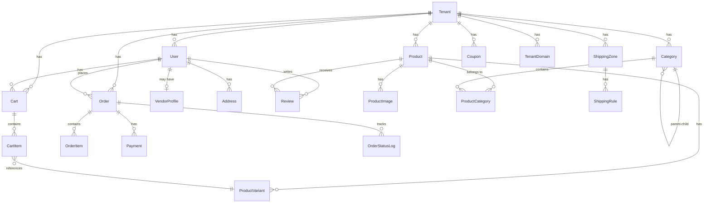

# CoreKit ECommerce — High-Level Design (HLD)

| Field            | Value                     |
| ---------------- | ------------------------- |
| **Project**      | CoreKit ECommerce         |
| **Version**      | 1.0.0                    |
| **Date**         | 2026-04-14                |

---

## 1. System Overview

CoreKit is a multi-tenant ECommerce SaaS platform where each tenant (store) operates in data isolation under shared infrastructure.

```
┌──────────────────────────────────────────────────────────────┐
│                        CLIENTS                                │
│   Browser (Next.js SSR)  ·  Mobile App  ·  3rd Party APIs    │
└──────────────┬───────────────────────────────┬───────────────┘
               │ HTTPS                         │ Webhooks
┌──────────────▼───────────────────────────────▼───────────────┐
│                     API GATEWAY / NGINX                       │
│           (SSL termination, rate limiting, routing)           │
└──────────────┬───────────────────────────────────────────────┘
               │
┌──────────────▼───────────────────────────────────────────────┐
│                 COREKIT BACKEND (NestJS)                      │
│  ┌─────────┐ ┌──────────┐ ┌──────┐ ┌────────┐ ┌──────────┐ │
│  │  Auth   │ │ Products │ │ Cart │ │ Orders │ │ Payments │ │
│  │ Module  │ │  Module  │ │Module│ │ Module │ │  Module  │ │
│  └─────────┘ └──────────┘ └──────┘ └────────┘ └──────────┘ │
│  ┌──────────┐ ┌──────────┐ ┌──────────┐ ┌────────────────┐ │
│  │Categories│ │Addresses │ │ Shipping │ │  Users · Email  │ │
│  │  Module  │ │  Module  │ │  Module  │ │  · Health       │ │
│  └──────────┘ └──────────┘ └──────────┘ └────────────────┘ │
│                                                              │
│  ┌────────────────────────────────────────────────────────┐  │
│  │            COMMON LAYER                                │  │
│  │  Guards: JWT Auth · Roles · Throttler                  │  │
│  │  Pipes: ValidationPipe (whitelist, transform)          │  │
│  │  Middleware: Helmet · Compression · CORS               │  │
│  └────────────────────────────────────────────────────────┘  │
└──────┬──────────────────────┬───────────────────┬────────────┘
       │                      │                   │
┌──────▼──────┐  ┌────────────▼────┐  ┌───────────▼──────┐
│ PostgreSQL  │  │     Redis 7     │  │   Razorpay API   │
│     16      │  │ Cache · Session │  │ Payment Gateway  │
│  (Prisma)   │  │ BullMQ Queues   │  │                  │
└─────────────┘  └─────────────────┘  └──────────────────┘
```

---

## 2. Architecture Style

| Aspect | Decision |
|--------|----------|
| **Pattern** | Modular Monolith (NestJS modules with clear boundaries) |
| **API Style** | RESTful with URI versioning (`/api/v1/`) |
| **Auth** | Stateless JWT with Passport.js strategies |
| **Multi-tenancy** | Shared database, `tenantId` column on every entity |
| **Frontend** | Server-side rendered (Next.js App Router) |
| **Queue** | BullMQ on Redis for async jobs (emails, etc.) |

---

## 3. Technology Stack

| Layer | Technology | Version |
|-------|-----------|---------|
| **Frontend** | Next.js (React 19) | 16.2.3 |
| **UI** | TailwindCSS | 4.x |
| **State** | TanStack React Query | 5.x |
| **Icons** | Lucide React | 1.x |
| **Backend** | NestJS (TypeScript) | 11.x |
| **ORM** | Prisma | 7.x |
| **Database** | PostgreSQL | 16 |
| **Cache/Queue** | Redis + BullMQ | 7.x |
| **Auth** | Passport.js + JWT | — |
| **Payments** | Razorpay | — |
| **Email** | Nodemailer | 8.x |
| **Docs** | Swagger / OpenAPI | auto-gen |
| **Container** | Docker | multi-stage |

---

## 4. Module Architecture

```mermaid
graph TB
    subgraph "App Module"
        direction TB
        AM[AppModule]
        AM --> CM[ConfigModule]
        AM --> TM[ThrottlerModule]
        AM --> PM[PrismaModule]
        AM --> RM[RedisModule]
        AM --> QM[QueueModule]
    end

    subgraph "Feature Modules"
        AM --> AUTH[AuthModule]
        AM --> USR[UsersModule]
        AM --> PROD[ProductsModule]
        AM --> CAT[CategoriesModule]
        AM --> CART[CartModule]
        AM --> ADDR[AddressesModule]
        AM --> ORD[OrdersModule]
        AM --> PAY[PaymentsModule]
        AM --> SHIP[ShippingModule]
        AM --> EMAIL[EmailModule]
        AM --> HLTH[HealthModule]
    end

    subgraph "Global Guards"
        G1[ThrottlerGuard]
        G2[JwtAuthGuard]
        G3[RolesGuard]
    end

    AM --> G1
    AM --> G2
    AM --> G3
```



---

## 5. Database Schema (ER Summary)



---

## 6. Security Architecture

```
Request Flow:
  Client → Helmet → CORS → Throttler → JwtAuthGuard → RolesGuard → Controller
```

| Layer | Mechanism |
|-------|-----------|
| **Transport** | HTTPS (TLS at reverse proxy) |
| **Headers** | Helmet (XSS, HSTS, CSP, etc.) |
| **CORS** | Whitelist-based origin control |
| **Rate Limiting** | 60 req/min global; 5/min register; 10/min login |
| **Authentication** | JWT Bearer tokens (access + refresh) |
| **Authorization** | Role-based guards (ADMIN, VENDOR, STAFF, CUSTOMER) |
| **Input Validation** | class-validator with whitelist + forbidNonWhitelisted |
| **Password** | bcrypt hashing |
| **Data Isolation** | tenantId scoping on all queries |

---

## 7. API Versioning

- **Strategy:** URI-based versioning
- **Default Version:** `v1`
- **Base URL:** `http://localhost:6767/api/v1/`
- **Swagger Docs:** `http://localhost:6767/api/docs`

---

## 8. Queue Architecture

```
┌────────────┐    enqueue    ┌─────────┐    process    ┌──────────┐
│ NestJS App │ ──────────► │  Redis  │ ──────────► │  Worker  │
│ (Producer) │              │ (Queue) │              │(Consumer)│
└────────────┘              └─────────┘              └──────────┘
                                                          │
                                                     ┌────▼────┐
                                                     │Nodemailer│
                                                     │ (SMTP)  │
                                                     └─────────┘
```

**Queue Types:**
- Email queue (welcome, OTP, order confirmation)
- Future: inventory sync, analytics events

---

## 9. Frontend Architecture

```
corekit-frontend/
├── src/
│   ├── app/                    # Next.js App Router pages
│   │   ├── page.tsx            # Home
│   │   ├── login/              # Auth
│   │   ├── register/
│   │   ├── products/           # Catalogue
│   │   │   └── [id]/
│   │   ├── categories/
│   │   ├── cart/
│   │   ├── checkout/
│   │   ├── orders/
│   │   │   └── [id]/
│   │   └── admin/
│   │       └── users/
│   ├── components/             # Shared UI components
│   │   └── Navbar.tsx
│   ├── contexts/               # React contexts (auth, cart)
│   ├── lib/
│   │   ├── api.ts              # API client (fetch wrapper)
│   │   └── utils.ts            # Utility functions
│   └── providers/              # TanStack Query, theme providers
```

---

## 10. Deployment Topology

```
┌──────────────────────────────────────────────────────┐
│                   Production                          │
│                                                      │
│  ┌──────────┐     ┌──────────────┐                   │
│  │  Vercel  │     │   Docker     │                   │
│  │ (Next.js │     │  Container   │                   │
│  │  SSR)    │◄───►│  (NestJS)    │                   │
│  └──────────┘     └──────┬───────┘                   │
│                          │                           │
│               ┌──────────┼──────────┐                │
│               │          │          │                │
│          ┌────▼───┐ ┌────▼───┐ ┌────▼──────────┐     │
│          │Postgres│ │ Redis  │ │  Razorpay     │     │
│          │  (RDS) │ │(Elasti-│ │  (External)   │     │
│          │        │ │ Cache) │ │               │     │
│          └────────┘ └────────┘ └───────────────┘     │
└──────────────────────────────────────────────────────┘
```

---

## 11. Key Design Decisions

| # | Decision | Rationale |
|---|----------|-----------|
| 1 | Modular Monolith over Microservices | Simpler deployment; can extract modules later |
| 2 | Shared DB multi-tenancy | Cost-effective; simpler ops for early stage |
| 3 | Prisma ORM | Type-safe queries, auto-migrations, good DX |
| 4 | BullMQ over raw Redis pub/sub | Built-in retry, delayed jobs, dashboard support |
| 5 | Next.js App Router | SSR for SEO; React Server Components for performance |
| 6 | JWT (not sessions) | Stateless auth; scales horizontally without session store |
| 7 | class-validator + whitelist | Prevents mass assignment; enforces DTO contracts |
