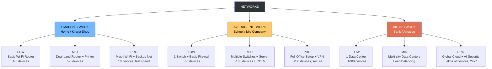

# Small, Average, and Big Networks — Explained Simply

Think of a **network** like a group of people who can talk to each other.
The "size" of the network just means **how many people (computers/devices) are talking**, and **how much space they need**.

We will use one simple story to understand all three: **a house, a colony, and a whole city**.

---

## 1. Small Network — "A Family Home"

### Real-life example:
Imagine **your home**.
- Mom, Dad, you, and your sister live there.
- You all share one TV, one fridge, one Wi-Fi router.
- If Mom wants to tell you dinner is ready, she just shouts from the kitchen.

### In computer language:
- **Around 1 to 10 devices** (a few phones, a laptop, a printer, a smart TV).
- Everything connects to **one Wi-Fi router**.
- No need for security guards, no need for a manager — Mom is in charge of everything.

### Where you see it:
- Your home
- A small shop
- A tiny office with 2–3 people

### Simple truth:
> **Small network = small family. Easy to manage, cheap, everyone knows everyone.**

---

## 2. Average (Medium) Network — "A Housing Society / Colony"

### Real-life example:
Now imagine a **housing society** with 50 flats.
- There's a **watchman at the gate** checking who comes in.
- There's a **society office** that handles complaints.
- There's a **common water tank, lift, and garden** shared by everyone.
- If someone throws garbage in the wrong place, the **secretary** talks to them.

### In computer language:
- **Around 10 to 200 devices** (computers, printers, phones, cameras).
- Needs **more than one router/switch** to connect everyone.
- Needs a **small IT team** (like the society secretary) to fix problems.
- Needs **basic security** (like the watchman — this is called a **firewall**).
- Needs **permissions** — not everyone can open the main gate or enter the office.

### Where you see it:
- A school
- A medium-size company (50–200 employees)
- A hospital
- A bank branch

### Simple truth:
> **Average network = a colony. Needs rules, a watchman, and someone to manage it.**

---

## 3. Big (Large / Enterprise) Network — "A Whole City"

### Real-life example:
Now imagine a **whole city** like Mumbai or Delhi.
- **Lakhs of people**, thousands of buildings, many roads.
- You need **traffic signals, highways, flyovers, police stations, hospitals, and electricity boards**.
- You cannot shout to tell your friend dinner is ready — you need a **phone call**.
- Different areas have different rules (hospital zone, school zone, industrial area).
- There is a **Mayor, Police Commissioner, and many departments** working together.

### In computer language:
- **Thousands or lakhs of devices** spread across many cities or even countries.
- Needs **many routers, switches, servers, and data centers** (huge computer rooms).
- Needs **heavy security** (like police + CCTV + checkpoints = firewalls + antivirus + monitoring).
- Needs a **large IT team**, sometimes **hundreds of engineers**.
- Needs **24x7 monitoring** — someone is always watching, even at night.
- Different departments have different access (just like a hospital zone is different from a market).

### Where you see it:
- Big companies like TCS, Infosys, Google, Amazon
- Government networks (Railways, Income Tax)
- Banks with branches all over the country
- Airports

### Simple truth:
> **Big network = a whole city. Needs many managers, many rules, heavy security, and never sleeps.**

---

## Quick Side-by-Side Comparison

| Thing | Small (Home) | Average (Colony) | Big (City) |
|---|---|---|---|
| **How many devices?** | Up to 10 | 10 – 200 | 200 to lakhs |
| **Who manages it?** | Mom / Dad | Society secretary | Big IT team |
| **Security** | Door lock | Watchman at gate | Police + CCTV + checkpoints |
| **Cost** | Very cheap | Medium | Very expensive |
| **Speed of setup** | 1 hour | A few days | Many months |
| **If it breaks** | Restart router | Call the IT guy | Whole team works on it |
| **Example places** | Your house, a shop | A school, a clinic | A bank, an airport, Google |

---

## Even Simpler — In One Line Each

- **Small Network** = Your **home WhatsApp family group**.
- **Average Network** = Your **school WhatsApp group** with teachers and students.
- **Big Network** = The **whole of Instagram or Facebook**, where crores of people are online at the same time.

---

## Why Does This Matter?

Because the **bigger the network**, the **more care** it needs:
- More people to manage it
- More money to maintain it
- More rules to keep it safe
- More equipment to keep it running

Just like taking care of a **plant**, a **garden**, and a **whole forest** — the idea is the same, but the effort is very different.

---

## E-Commerce Example — Selling Things Online

Let's use the same idea but now in the world of **online shopping**.
Imagine three different shop owners — all selling clothes — but at very different levels.

---

### Small Network — "Ramesh Bhai's Instagram Shop"

Ramesh Bhai sells sarees from his **home**.
- He has **1 laptop**, **1 phone**, and **1 printer** for labels.
- He uses **home Wi-Fi**.
- He posts sarees on Instagram and WhatsApp.
- Orders come in — maybe **5 to 20 per day**.
- He packs them himself and gives them to the courier boy.

**Network needs:**
- Just a normal Wi-Fi router from Jio/Airtel.
- One basic laptop.
- That's it.

**If Wi-Fi goes down?**
Ramesh Bhai uses his phone's hotspot. Problem solved in 2 minutes.

> **Like a small kirana store — simple, cheap, one person runs everything.**

---

### Average Network — "FashionHub — A Growing Online Store"

FashionHub is a **medium online clothing brand**.
- They have a **small office with 30–50 employees** (designers, photographers, customer support, accounts, packers).
- They have **their own website** like fashionhub.in.
- They get **500 to 5000 orders per day**.
- They have a **small warehouse** where products are stored.
- They have **CCTV cameras**, **billing computers**, and **barcode scanners**.

**Network needs:**
- Multiple routers and switches in the office and warehouse.
- A **server** that runs the website (or rented space on AWS/Cloud).
- **Basic firewall** to protect customer data (names, addresses, payment info).
- A **small IT team of 2–5 people** to keep everything running.
- **Backup internet line** — if one goes down, the other takes over.

**If the website goes down?**
The IT team gets an alert. They fix it in 1–2 hours. Maybe 100 customers get angry — but business survives.

> **Like a mid-size showroom — more staff, more systems, needs proper management.**

---

### Big Network — "Amazon / Flipkart / Myntra"

Now imagine **Amazon** or **Flipkart**.
- **Lakhs of employees** across many countries.
- **Crores of customers** shopping at the same time.
- **10+ warehouses** (called Fulfillment Centers) in different cities.
- **Millions of products** listed.
- During **Big Billion Day / Great Indian Sale**, they handle **lakhs of orders per minute**.

**Network needs:**
- **Huge data centers** — buildings full of servers, cooled with AC 24x7.
- **Thousands of engineers** working in shifts, day and night.
- **Multiple layers of security** — to stop hackers, fraud, fake orders.
- **Advanced firewalls, AI-based monitoring, CCTV, and biometric access**.
- **Many internet lines from different providers** — if one fails, others work.
- **Servers in different countries** — so if one city has a power cut, another city's servers take over.
- **Load balancers** — like a traffic police system that sends customers to the least busy server.

**If the website goes down?**
- Alarms ring in the control room.
- Hundreds of engineers jump in.
- News channels report it within minutes.
- Every minute of downtime = crores of rupees lost.

> **Like a whole shopping mall chain + a factory + a delivery empire — running non-stop, all over the world.**

---

### Quick E-Commerce Comparison

| Thing | Ramesh Bhai's Shop | FashionHub | Amazon / Flipkart |
|---|---|---|---|
| **Orders per day** | 5 – 20 | 500 – 5,000 | Lakhs to crores |
| **Employees** | 1 (himself) | 30 – 50 | Lakhs |
| **Website** | Instagram / WhatsApp | Own website | Own global platform |
| **Warehouse** | His bedroom | 1 small godown | Many huge warehouses |
| **IT team** | None | 2 – 5 people | Thousands |
| **If website is slow** | Doesn't matter | Few complaints | National news |
| **Security** | Phone password | Basic firewall | Military-grade security |
| **Cost per month** | ₹1,000 (Wi-Fi) | ₹1 – 5 lakh | Crores of rupees |

---

### One-Line Summary for E-Commerce

- **Small** = Selling on WhatsApp from home.
- **Average** = Running your own branded website with a team.
- **Big** = Being Amazon — where the whole world shops at once.

---

## Hierarchy Diagram — Networks and Their Packages

Each network type comes in **3 packages**:
- **Low** → Bare minimum, just start the work.
- **Mid** → Balanced, good for daily use.
- **Pro** → Top quality, fast, safe, powerful.

---

### Tree View (Simple)

```
                          ┌──────────────────────┐
                          │      NETWORKS        │
                          └──────────┬───────────┘
                                     │
          ┌──────────────────────────┼──────────────────────────┐
          │                          │                          │
  ┌───────▼────────┐        ┌────────▼────────┐        ┌────────▼────────┐
  │  SMALL NETWORK │        │ AVERAGE NETWORK │        │   BIG NETWORK   │
  │    (Home)      │        │   (Colony)      │        │     (City)      │
  └───────┬────────┘        └────────┬────────┘        └────────┬────────┘
          │                          │                          │
    ┌─────┼─────┐              ┌─────┼─────┐              ┌─────┼─────┐
    │     │     │              │     │     │              │     │     │
  ┌─▼─┐ ┌─▼─┐ ┌─▼─┐          ┌─▼─┐ ┌─▼─┐ ┌─▼─┐          ┌─▼─┐ ┌─▼─┐ ┌─▼─┐
  │LOW│ │MID│ │PRO│          │LOW│ │MID│ │PRO│          │LOW│ │MID│ │PRO│
  └───┘ └───┘ └───┘          └───┘ └───┘ └───┘          └───┘ └───┘ └───┘
```

---

### Mermaid Diagram (renders as a real chart)



---

### Package Details for Each Network

#### 🏠 SMALL NETWORK (Home / Tiny Shop)

| Package | What You Get | Real Example | Cost (approx.) |
|---|---|---|---|
| **LOW** | 1 basic Wi-Fi router, 1–3 devices, slow speed | Ramesh Bhai's home shop | ₹500 – ₹1,000 / month |
| **MID** | Dual-band router, printer, 5–8 devices, decent speed | Small tailor shop with billing system | ₹1,000 – ₹2,500 / month |
| **PRO** | Mesh Wi-Fi (full home coverage), backup internet, 10+ devices, fast speed | Work-from-home professional | ₹3,000 – ₹5,000 / month |

---

#### 🏘️ AVERAGE NETWORK (School / Mid-size Company)

| Package | What You Get | Real Example | Cost (approx.) |
|---|---|---|---|
| **LOW** | 1 main switch, basic firewall, ~50 devices, 1 IT guy | Small school, small clinic | ₹20,000 – ₹50,000 / month |
| **MID** | Multiple switches, local server, CCTV, ~100 devices | Mid-size company, bank branch | ₹1 – 3 lakh / month |
| **PRO** | Full office network, VPN for remote staff, advanced firewall, ~200 devices | Medium hospital, FashionHub-type e-commerce | ₹3 – 8 lakh / month |

---

#### 🏙️ BIG NETWORK (Enterprise / City-scale)

| Package | What You Get | Real Example | Cost (approx.) |
|---|---|---|---|
| **LOW** | 1 data center, ~1000 devices, basic redundancy | Medium-large bank | ₹50 lakh – 1 crore / month |
| **MID** | Data centers in multiple cities, load balancing, 24x7 monitoring | Big IT company, national bank | 2 – 10 crore / month |
| **PRO** | Global cloud, AI-powered security, auto-scaling, lakhs of devices | Amazon, Flipkart, Google, Meta | 50+ crore / month |

---

### Simple Story to Remember

Think of it like **buying a vehicle**:

- **SMALL Network = Bicycle / Scooter**
  - *Low* = Cycle
  - *Mid* = Normal scooter (Activa)
  - *Pro* = Electric scooter with all features

- **AVERAGE Network = Car**
  - *Low* = Maruti Alto
  - *Mid* = Honda City
  - *Pro* = Toyota Fortuner

- **BIG Network = Airplane / Ship**
  - *Low* = Small private jet
  - *Mid* = Commercial flight
  - *Pro* = Jumbo international airline fleet

As you go from **Low → Mid → Pro**, you get:
- More **speed**
- More **safety**
- More **capacity**
- More **cost**

---

*Made simple so that even someone who has never touched a computer can understand it.*
